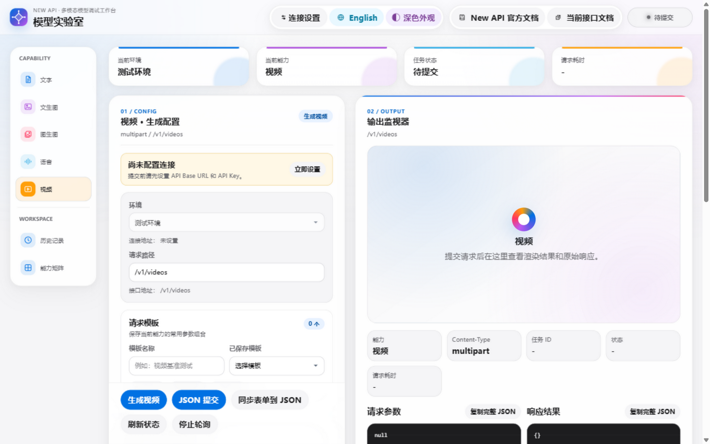
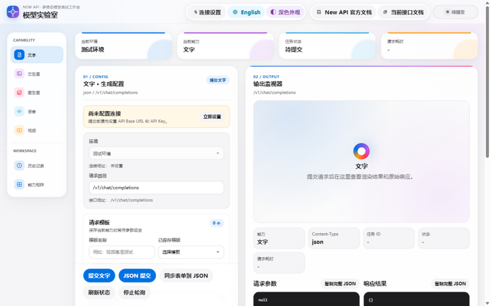
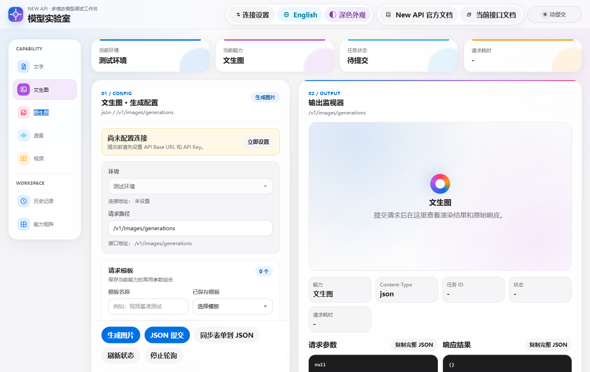

[简体中文](README.md) | [English](README.en.md)

# newapi-web-test

An open-source multimodal model debugging frontend built with Vue 3 + Vite, for verifying text, image, speech, and video model requests directly in the browser.

  



## Introduction

Debugging multimodal models usually means assembling curl commands, tweaking parameters, and inspecting raw responses over and over. This project turns that workflow into a pure static web page: pick a capability (text / text-to-image / image-to-image / speech / video), fill in the model and parameters, submit straight from the browser, and inspect the request preview, raw response, and error diagnostics.

The project ships with no built-in API endpoint, API key, password, or runtime secret configuration. On first load there is only an empty "test environment" — both the base URL and the key are blank and must be entered temporarily via "Connection Settings" in the top-right corner. It suits developers and operations engineers who need to quickly verify New API or other OpenAI-compatible gateways and LLM endpoints.

## ✨ Features

- **Text chat**: `/v1/chat/completions`, with system prompt, temperature, and Max Tokens
- **Text-to-image**: `/v1/images/generations`; Gemini models automatically switch to native `generateContent`
- **Image-to-image**: `/v1/images/edits` (multipart), supporting local images and image URLs
- **Speech synthesis**: instruction-based `cosyvoice-v3-flash` audio generation with narration/dialog modes, voice, and output format
- **Video generation**: `/v1/videos` task creation, status polling every 5 seconds (up to 200 times), authorized playback and download
- **Dual submission modes**: form or JSON, with switchable request preview and raw response views
- **Debugging aids**: error diagnostics and one-click copy of debug data
- **Local history**: up to 50 browser-local history entries with masked Authorization info
- **UI**: Chinese/English bilingual interface with dark and light themes

### Security Design

Connection settings follow a "page input, session use" principle:

- API Base URL and API Key are never read from `.env`, Docker environment variables, source code, or runtime configuration
- The API Key uses a password input with temporary show/hide; connection settings are cleared automatically on page refresh
- The API Key is never written to LocalStorage, request history, or the browser console
- Submission is blocked when the key is empty, and Connection Settings opens automatically as a reminder

> History entries store the request URL, request parameters, and responses in the current browser's LocalStorage. On shared devices, clear the history in the page when you are done.

## 🛠 Tech Stack

| Area | Component | Version |
| --- | --- | --- |
| Frontend framework | Vue | 3.5 |
| Build tool | Vite | 5.4 |
| Testing | Vitest + jsdom + @vue/test-utils | 2.x |
| Container | Node 20-alpine build + Nginx 1.27-alpine static hosting | - |

## 🚀 Quick Start

```bash
npm ci
npm run dev      # Start the Vite dev server on port 5173 (requires Node.js 18+, 20 recommended)
npm run test     # Run Vitest tests
npm run build    # Build production assets into dist/
```

After opening the page:

1. Click "Connection Settings" in the top-right corner.
2. Enter the full API Base URL and API Key.
3. Click "Save and use".
4. Pick a capability, model, and parameters, then submit.

Connection settings live only in the current page session and must be re-entered after a refresh.

### One-click GitHub Pages Deployment

The repo ships with [`.github/workflows/deploy-pages.yml`](.github/workflows/deploy-pages.yml). Pushes to `main` automatically test, build, and publish `dist/` — no secrets required:

1. Push the project to the `main` branch of your GitHub repo.
2. Open the repo's `Settings -> Pages` and set Source to `GitHub Actions`.
3. Wait for `Deploy to GitHub Pages` to finish; you can also re-publish manually via `workflow_dispatch` on the Actions page.
4. Open the Pages site and fill in your own API endpoint and key under "Connection Settings".

GitHub Pages only hosts the static frontend; the browser calls whatever API URL you enter. The API service must therefore support HTTPS and CORS, the `GET`/`POST`/`OPTIONS` methods, and the `Authorization` and `Content-Type` headers. If your API does not allow cross-origin requests, deploy a reverse proxy under your own domain — never commit proxy credentials to this repo.

### Docker Deployment

The Docker image contains only the static frontend (Nginx serving `dist/`) and reads no endpoint or credential environment variables.

```bash
docker build -t newapi-model-tester .
docker run --rm -p 5173:80 newapi-model-tester
# or
docker compose up -d
```

## 📁 Project Structure

```text
.
├── .github/workflows/       # GitHub Pages auto deployment
├── nginx/                   # Docker static site config
├── src/
│   ├── App.vue              # Page, connection settings, task and history flows
│   ├── api.js               # Request/URL/header and task status helpers
│   ├── i18n.js              # Chinese and English strings
│   ├── modelPresets.js      # Capabilities, models, defaults, payload builders
│   └── *.test.js            # Vitest unit and component tests
├── Dockerfile / docker-compose.yml
└── vite.config.js
```

## 📸 Screenshots






## 📄 License

No LICENSE file is bundled with the repository yet; confirm with the author before redistributing.

## Contributing

Keep ES modules, single quotes, semicolons, and 2-space indentation. Behavioral changes should come with focused tests, and `npm run test` plus `npm run build` must pass.
