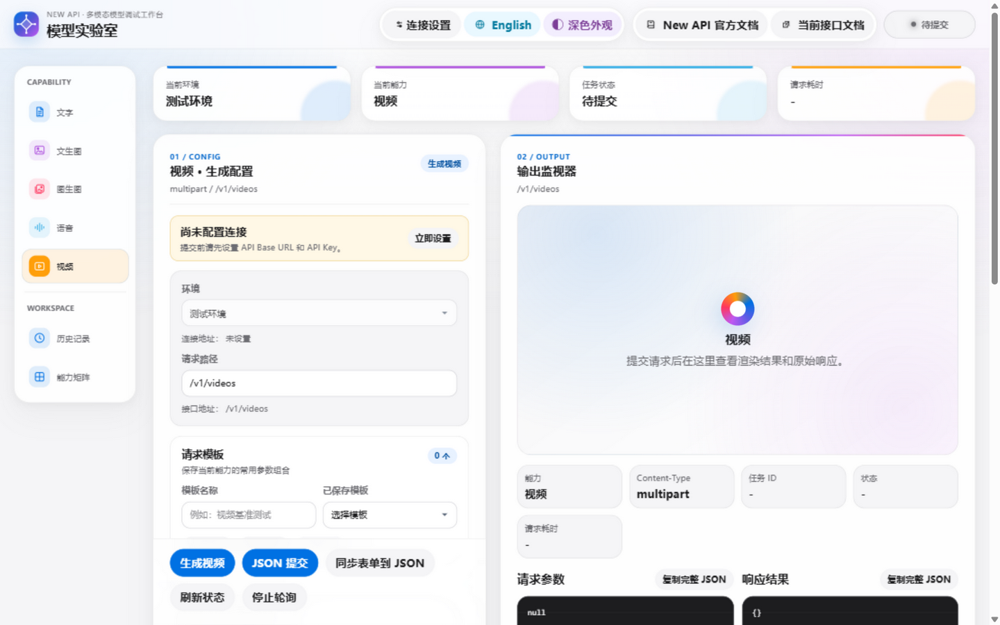

# New API 模型测试平台

一个基于 Vue 3 + Vite 的开源多模态模型调试前端，用于在浏览器中验证文字、图片、语音和视频模型请求。



项目不内置 API 服务地址、API Key、密码或运行时密钥配置。首次打开页面时只有一个“测试环境”，连接地址和 Key 均为空，必须通过右上角“连接设置”临时填写。

## 核心能力

- 文字：`/v1/chat/completions`
- 文生图：OpenAI 图片接口与 Gemini 原生 `generateContent`
- 图生图：`/v1/images/edits`
- 语音：指令式 `cosyvoice-v3-flash` 音频生成
- 视频：`/v1/videos` 创建、状态轮询、鉴权播放与下载
- 表单与 JSON 两种提交方式
- 请求预览、原始响应、错误诊断和复制调试数据
- 最多 50 条浏览器本地历史记录
- 中英文界面与深浅色主题

## 安全设计

连接配置遵循“页面输入、会话使用”的原则：

- API Base URL 和 API Key 不从 `.env`、Docker 环境变量、源码或运行时配置读取。
- API Key 使用密码输入框，支持临时显示或隐藏。
- 页面刷新后连接配置自动清空。
- API Key 不写入 LocalStorage、请求历史或浏览器控制台。
- 请求预览和历史记录只保留脱敏后的 Authorization 信息。
- Key 为空时禁止提交，并自动打开连接设置提醒用户补充。

> 历史记录会在当前浏览器的 LocalStorage 中保存请求 URL、请求参数和响应结果。共享设备使用完毕后，请在页面中清空历史记录。

## 快速开始

环境要求：Node.js 18+，推荐 Node.js 20。

```bash
npm ci
npm run dev
```

开发服务器默认监听本机 `5173` 端口。打开页面后：

1. 点击右上角“连接设置”。
2. 输入完整的 API Base URL 和 API Key。
3. 点击“保存并使用”。
4. 选择能力、模型和参数后提交请求。

连接配置只存在于当前页面会话，刷新页面后需要重新填写。

## GitHub Pages 一键部署

仓库包含 [`.github/workflows/deploy-pages.yml`](.github/workflows/deploy-pages.yml)。工作流会在推送到 `main` 后自动执行测试、构建并发布 `dist/`，不需要配置 API 地址、API Key 或仓库 Secret。

部署步骤：

1. 将项目推送到 GitHub 仓库的 `main` 分支。
2. 打开仓库 `Settings -> Pages`。
3. 将 `Build and deployment` 的 Source 设为 `GitHub Actions`。
4. 打开 `Actions`，等待 `Deploy to GitHub Pages` 完成。
5. 进入 Pages 站点，在页面“连接设置”中填写自己的 API 地址和 Key。

也可以在 Actions 页面通过 `workflow_dispatch` 手动重新发布。

### GitHub Pages 跨域要求

GitHub Pages 只托管静态前端。浏览器会直接请求用户填写的 API 地址，因此 API 服务必须：

- 使用 HTTPS；
- 允许 Pages 站点来源的 CORS 请求；
- 允许 `Authorization` 和 `Content-Type` 请求头；
- 允许项目使用的 `GET`、`POST` 和 `OPTIONS` 方法。

如果 API 不允许跨域，请在自己的域名下部署反向代理，不要把代理凭据写入本仓库。

## Docker 部署

Docker 镜像只包含静态前端，不读取任何服务地址或凭据环境变量。

```bash
docker build -t newapi-model-tester .
docker run --rm -p 5173:80 newapi-model-tester
```

访问映射端口后，在页面“连接设置”中填写 API Base URL 和 API Key。

## 可用命令

```bash
npm run dev      # 启动 Vite 开发服务器
npm run test     # 运行 Vitest 测试
npm run build    # 构建生产产物到 dist/
```

## 模型与接口

| 能力 | 默认接口 | 提交方式 | 说明 |
| --- | --- | --- | --- |
| 文字 | `/v1/chat/completions` | JSON | 支持系统提示词、温度和 Max Tokens |
| 文生图 | `/v1/images/generations` | JSON | Gemini 模型自动切换到原生 `generateContent` |
| 图生图 | `/v1/images/edits` | multipart | 支持本地图片与图片 URL |
| 语音 | `/v1/chat/completions` | JSON | 支持旁白/对话模式、音色和输出格式 |
| 视频 | `/v1/videos` | multipart 或 JSON | 支持多图、参考图、Metadata、轮询与下载 |

模型列表和表单默认值集中维护在 [`src/modelPresets.js`](src/modelPresets.js)，避免在组件中重复定义。

## 视频任务流程

1. `POST /v1/videos` 创建任务。
2. 页面每 5 秒查询一次任务状态，最多 200 次。
3. 进入终态后停止轮询。
4. 成功任务优先通过 `/v1/videos/{taskID}/content` 获取鉴权媒体流。
5. 内容接口不可用时，仅对明确的媒体文件地址回退直链。

支持的终态：`completed`、`done`、`succeeded`、`failed`、`cancelled`。

## 项目结构

```text
.
├── .github/workflows/       # GitHub Pages 自动部署
├── nginx/                   # Docker 静态站点配置
├── src/
│   ├── App.vue              # 页面、连接设置、任务和历史流程
│   ├── api.js               # 请求、URL、Header 和任务状态辅助函数
│   ├── i18n.js              # 中英文文案
│   ├── modelPresets.js      # 能力、模型、默认值和 Payload 构造
│   ├── styles.css           # 全局样式
│   └── *.test.js            # Vitest 单元与组件测试
├── Dockerfile
├── docker-compose.yml
├── vite.config.js
└── package.json
```

## 开源发布检查

- 仓库中不得加入真实 API 地址、API Key、密码、Token 或私钥。
- 不要提交 `.env`、`.env.local`、日志、构建产物和依赖目录。
- 提交前运行 `npm run test`、`npm run build` 和敏感信息扫描。
- 如果凭据曾写入本地文件、提交历史、日志或聊天记录，应立即在服务端吊销并轮换；删除文件不能使旧凭据失效。
- 正式公开仓库前，请根据项目需要选择并添加合适的 `LICENSE` 文件。

## 贡献

改动应保持 ES modules、单引号、分号和 2 空格缩进。行为变更需要补充聚焦测试，并确保测试与生产构建通过。
